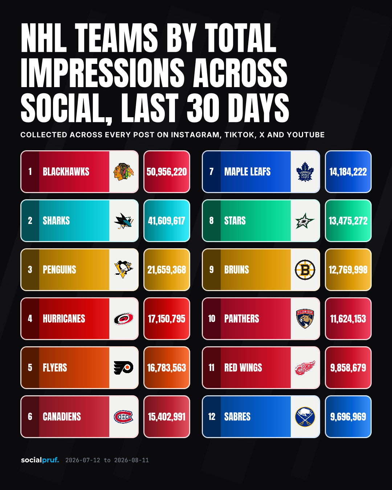

# socialpruf-list-bot

Every day, this picks a ranked list out of Socialpruf data, decides whether it's
worth posting, renders it as a card, and stages it for X. The list is chosen by a
model against a written editorial standard; the numbers on the card are whatever
the Socialpruf API returned.



That's a real run from 11 August 2026, unedited. Nothing in it was typed by
hand, the model picked the league, picked the metric, picked the window, and
cut the list at twelve. The renderer did the rest.

## Why that list, that day

Judgment is a single API call: a compact packet describing what data actually
exists goes in, a structured `ListSpec` comes out. It can only propose lists the
packet supports. Its recorded reasoning for the card above:

> NHL and NFL/NBA/MLB metrics are all recently used (engagement_rate on NFL,
> new_followers on NBA, likes on NHL, emv/followers on MLB repeatedly). NHL
> hasn't had impressions or emv posted recently — its last post was likes.
> Impressions on NHL with full 4-platform mix is fresh: different metric than
> NHL's last post, and no org has used impressions yet. This surfaces raw reach
> leaders, a legitimate new angle.

The same call has to commit to an angle and name what's wrong with it:

> **Angle** — Impressions haven't been posted for any league yet, and reach
> doesn't map cleanly to follower count — a good test of who's actually being
> seen versus who's just followed.
>
> **Caveat** — Raw reach, not rate-adjusted — favors teams that post more often.

The editorial standard it's judged against lives in
[`config/taste.md`](config/taste.md). That file is the real tuning surface —
edit it when a post lands badly.

## The pipeline

```
awareness → judgment → feasibility → fetch → verify → caption → render
```

**Awareness** probes each org for coverage — entity counts, platforms, freshest
data date, known gaps — and compacts it into a few hundred tokens. The packet
stays curated rather than a dump of raw API responses, which is what keeps
judgment from inventing coverage that isn't there.

**Feasibility** rejects impossible specs before any money is spent, hands back a
named reason, and judgment gets one retry with the problem stated.

**Fetch, verify, and render make no decisions.** They are deterministic code
operating on the spec. Verify fails closed: a run that produces nothing beats a
run that produces a wrong ranking.

## Receipts

Every run writes a directory:

```
output/2026-08-11_nhl-teams-by-total-impressions-across-social-last-30-days/
  card.png        # the thing you post
  card.svg        # source, if you want to tweak it
  caption.txt     # post copy
  receipt.json    # spec, exact query, returned values, timestamp, token usage
```

`receipt.json` is what makes a wrong number answerable. The query behind the card
above, verbatim:

```json
"rawQuery": {
  "route": "statsByEntity",
  "org": "nhl-league",
  "platforms": ["instagram", "tiktok", "twitter", "youtube"],
  "metric": "impressions",
  "start": "2026-07-12",
  "end": "2026-08-11",
  "leagueRosterExcluded": ["LA Kings", "St.Louis Blues"],
  "ownAccountExcluded": true
}
```

Alongside it: every row as returned, the model used, and the token count for the
run.

`output/` is gitignored, and in Actions it lives on a runner that's destroyed
when the job ends. So each run also appends one line to a committed digest:

```
history/posts.jsonl
  {"generatedAt":"2026-08-11T14:02:07.318Z","title":"NHL Teams by Total Impressions…",
   "orgSlugs":["nhl-league"],"metric":"impressions","platforms":["instagram","tiktok","twitter","youtube"]}
```

That's the novelty history judgment reads to avoid repeating itself. Five fields,
no follower counts — the receipt keeps the full record, and this repo is public.
Without it a scheduled run wakes up with no memory of yesterday and re-proposes
the same list.

## Rendering

The card is programmatically rendered, not AI-generated. Diffusion models mangle
text and numbers, so the visual is a deterministic template, which is also what
lets the card's numbers provably match the API response.

Near-ties, partial coverage, and non-comparable
entities are caught by explicit checks in `src/verify/checks.ts`, not by
judgment. Anything those checks don't cover will ship.

Generating and posting are separate commands, permanently. The generator writes
files and stops; posting is a second, deliberate action that defaults to a dry
run. That split is the difference between an automated content strategy and a
bot that published a wrong ranking at 3am.

## Run it

```bash
pnpm install
cp .env.example .env           # one Socialpruf key per org, plus Anthropic
pnpm probe                     # what data actually exists right now
pnpm generate                  # writes output/<date>_<slug>/
pnpm preview                   # re-render the last card while editing styles
pnpm post output/<dir>         # prints what it would send, sends nothing
DRY_RUN=false pnpm post output/<dir>
```
